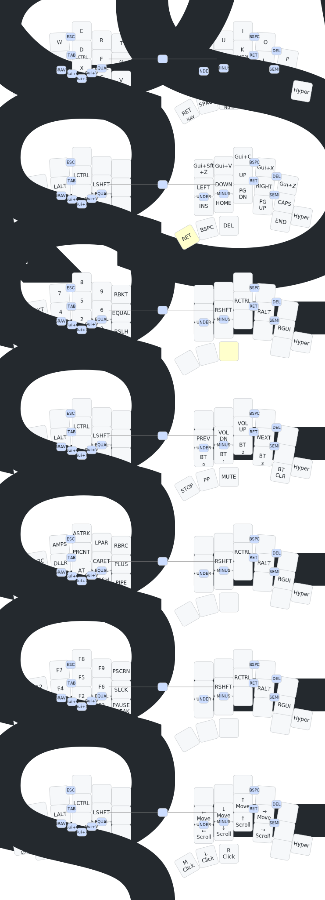

# TOTEM ZMK Config

ZMK firmware configuration for the [TOTEM](https://github.com/GEIGEIGEIST/TOTEM) split keyboard with [ZMK Studio](https://zmk.studio/) support.

## Hardware

| Component | Detail |
|-----------|--------|
| Board | Seeeduino XIAO BLE (nRF52840) |
| Shield | TOTEM (38-key split) |
| Firmware | ZMK (main branch, Zephyr 4.1) |
| Studio | Enabled on left half |

## Layout

Miryoku-style layout with QWERTY base and vim-style navigation.

### Base Layer (QWERTY + Home Row Mods)

```
     Q       W       E       R       T          Y       U       I       O       P
     GUI/A   ALT/S   CTRL/D  SHFT/F  G          H       SHFT/J  CTRL/K  ALT/L   GUI/'
     Z       X       C       V       B          N       M       ,       .       /
                    MEDIA/ESC NAV/SPC MOUSE/TAB  SYM/ENT NUM/BSPC FUN/DEL
```

### Keymap Diagram



## Layers

| Layer | Thumb Key | Left Hand | Right Hand |
|-------|-----------|-----------|------------|
| **BASE** | — | QWERTY | QWERTY |
| **NAV** | Hold Space | Home row mods | Vim arrows (HJKL), clipboard, nav |
| **NUM** | Hold Backspace | Numpad ([ 7 8 9 ], ; 4 5 6 =, ` 1 2 3 \) | Home row mods |
| **MEDIA** | Hold Escape | Home row mods | Media controls, BT profiles |
| **SYM** | Hold Enter | Symbols ({ & * ( }, : $ % ^ +, ~ ! @ # \|) | Home row mods |
| **FUN** | Hold Delete | Function keys (F1-F12), PrtSc, ScrLk | Home row mods |
| **MOUSE** | Hold Tab | Home row mods | Mouse movement, scroll, buttons (L/M/R click) |

## Home Row Mods (GACS)

| Finger | Left | Right |
|--------|------|-------|
| Pinky | GUI | GUI |
| Ring | ALT | ALT |
| Middle | CTRL | CTRL |
| Index | SHIFT | SHIFT |

Settings: tap-preferred, 200ms tapping term, 175ms quick-tap, 150ms require-prior-idle.

## Building

Firmware builds automatically via GitHub Actions on every push. Download the `.uf2` files from the [Actions](../../actions) tab.

To flash:
1. Double-tap the reset button on the XIAO BLE to enter bootloader mode
2. Drag the `.uf2` file to the mounted drive
3. Flash left half first (`totem_left`), then right (`totem_right`)

## ZMK Studio

The left half is built with ZMK Studio support. Connect via USB and open [zmk.studio](https://zmk.studio/) to edit the keymap in real time.

## Keymap Diagram Generation

Keymap SVG diagrams are auto-generated on every keymap change using [keymap-drawer](https://github.com/caksoylar/keymap-drawer) via GitHub Actions.
